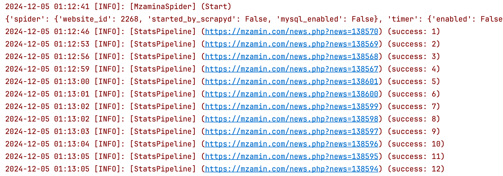

# dg_spider

# 1 简介
## 1.1 功能
dg_spider 是一款功能强大的多语种语料获取与管理平台（Corpus Acquisition and Management Platform, CAMP），专为高效运行和管理Scrapy爬虫框架开发的语料获取程序而设计。平台支持任务分发、实时监控和结果存储，尤其适用于对可追溯性、可扩展性及稳定性要求较高的语料获取场景，为语料资源采集的生产环境提供了强大的保障。

| **类别** | **功能** | **描述**                         |
| ------ | ------ | ------------------------------ |
| 爬虫     | 爬虫部署   | 自动部署爬虫到多节点，自动同步脚本或程序等爬虫文件      |
|        | 代码修改   | 实时在线更新和编辑脚本代码                  |
|        | 统计数据   | 爬虫运行统计数据，例如平均运行时长以及结果数量        |
|        | 框架集成   | 基础爬虫框架，例如 Scrapy, Selenium     |
|        | 存储集成   | 自动保存结果数据到 MySql 数据库            |
|        | Git 集成 | 通过内置或外部远程 Git 仓库进行版本管理         |
| 任务     | 任务调度   | 派发调度爬虫任务到分布式系统中多个节点            |
|        | 任务日志   | 自动保存任务日志                       |
|        | 数据统计   | 可视化展示任务数据，例如结果数量和运行时长          |
| 用户     | 用户管理   | Todo: 创建、更新、删除用户账号，权限管理        |
| 消息     | 消息通知   | Todo: 当任务触发或结束时，自动发送邮件或移动端消息通知 |
用户管理、消息通知、代码上传、定时运行等功能由前端同学完成。

## 1.2 后端运行截图


# 2 安装
## 2.1 Docker
### 2.1.1 建数据库
运行SQL：`dg_spider/docs/dg_dev_crawler.sql`
修改dev配置：`dg_spider/dg_spider/resources/config/config.yaml`
### 2.1.2 构建并启动容器
```
docker build -t dg_spider .
docker run -p 6801:6801 --name dg_spider_container dg_spider
```
## 2.2 Python
### 2.2.1 建数据库
运行SQL：`dg_spider/docs/dg_dev_crawler.sql`
修改dev配置：`dg_spider/dg_spider/resources/config/config.yaml`
### 2.2.2 安装Conda环境
```
conda create -n dg_spider python=3.10.15
pip install -r requirements.txt
```
### 2.2.3 启动框架
进程1：
```
scrapyd
```
进程2：
```
python flask_app.py
```
### 2.2.4 初始化框架
运行命令：
```
scrapyd-deploy
```

# 3 API
## 3.1 API简介
受各种因素影响，请求前端时仅需提供task_id，请求之前需要将task的详细参数存入数据库。

| Url             | Method | Body                | Response                          | 功能   |
| --------------- | ------ | ------------------- | --------------------------------- | ---- |
| /api/execute    | post   | {"task_id": "uuid"} | {"has_error": True, "msg": "..."} | 启动爬虫 |
| /api/cancel     | post   | {"task_id": "uuid"} | {"has_error": True, "msg": "…"}   | 停止爬虫 |
| /api/get_status | post   | {"task_id": "uuid"} | {"has_error": True, "msg": "…"}   | 查看状态 |
| /api/get_log    | post   | {"task_id": "uuid"} | {"has_error": True, "msg": "…"}   | 获取日志 |

## 3.2 Task参数示例
```json
{  
  "spider": {
    "website_id": 2268,
    "started_by_scrapyd": false,  
    "mysql_enabled": false  
  },  
  "timer": {
    "enabled": false,  
    "crawl_until_datetime": "2024-12-03T03:47:39+08:00"  
  },  
  "audit": {  
    "enabled": false,  
    "audit_id": 1,  
    "mysql_enabled": false  
  },  
  "proxy": {  
    "enabled": false,  
    "mode": "lab",  
    "temp": {  
      "ip": "127.0.0.1",  
      "port": 1234  
    }  
  }  
}
```

## 3.3 Task参数详解
### 3.3.1 Spider节点
控制爬虫的基本运行参数。

| 字段名                | 类型   | 默认值   | 说明                            |
| ------------------ | ---- | ----- | ----------------------------- |
| website_id         | int  | 必填    | 网站 ID，用于区分不同站点。               |
| started_by_scrapyd | bool | false | 是否由 Scrapyd 启动，用于区分本地调试与平台运行。 |
| mysql_enabled      | bool | false | 是否将语料存入 MySQL，用于适应本地调试场景。     |

```
{  
  "spider": {
    "website_id": 2268,
    "started_by_scrapyd": false,  
    "mysql_enabled": false  
  }
}
```

### 3.3.2 Timer节点
用于配置定时任务和爬取截止时间。

| 字段名                  | 类型     | 默认值   | 说明                                               |
| -------------------- | ------ | ----- | ------------------------------------------------ |
| enabled              | bool   | false | 是否启用定时功能。                                        |
| crawl_until_datetime | string | 必填    | 爬取任务的截止时间，格式为 ISO 8601 (YYYY-MM-DDTHH:mm:ss+TZ)。 |

```
{
  "timer": {
    "enabled": false,  
    "crawl_until_datetime": "2024-12-03T03:47:39+08:00"  
  } 
}
```
### 3.3.3 Audit 节点
用于配置审计相关功能。

| 字段名           | 类型   | 默认值   | 说明                 |
| ------------- | ---- | ----- | ------------------ |
| enabled       | bool | false | 是否启用审计功能。          |
| audit_id      | int  | int   | 审计任务ID。            |
| mysql_enabled | bool | false | 是否启用 MySQL 存储审计数据。 |

```
{
  "audit": {  
    "enabled": false,  
    "audit_id": 1,  
    "mysql_enabled": false  
  }
}
```
### 3.3.4 Proxy节点
配置代理设置，支持多种代理模式。

| 字段名     | 类型     | 默认值   | 说明                                |
| ------- | ------ | ----- | --------------------------------- |
| enabled | bool   | false | 是否启用代理功能。                         |
| mode    | string | "lab" | 代理模式："lab" 接入实验室代理，"temp" 使用本地代理。 |
| temp    | object | {}    | 本地代理设置，包括 IP 和端口信息。               |

temp子字段：

| 字段名  | 类型     | 默认值 | 说明           |
| ---- | ------ | --- | ------------ |
| ip   | string | 必填  | 本地代理的 IP 地址。 |
| port | int    | 必填  | 本地代理的端口号。    |

```
{
  "proxy": {  
    "enabled": false,  
    "mode": "lab",  
    "temp": {  
      "ip": "127.0.0.1",  
      "port": 1234  
    }  
  }  
}
```


